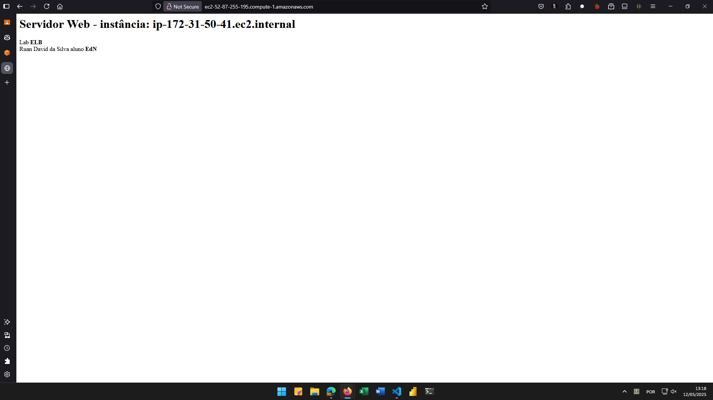

# Laboratório Elastic Load Balancer e Auto Scaling

## Habilidades Desenvolvidas:
- Usar a VPC padrão para simplificar a configuração de rede.

- Criar um Launch Template para definir as configurações das suas instâncias EC2.

- Configurar um Auto Scaling Group para gerenciar automaticamente o número de instâncias com base na demanda (mesmo que, neste laboratório  simplificado, tenhamos mantido um número fixo de instâncias).

- Criar um Application Load Balancer para distribuir o tráfego de forma inteligente entre as instâncias.

- Integrar o Auto Scaling Group e o Load Balancer para garantir que novas  instâncias sejam automaticamente adicionadas ao balanceamento de carga e  instâncias com falha sejam removidas.

- Verificar o funcionamento do ambiente e solucionar problemas comuns.

## Evidências do Lab
<details>
<summary>Aplicação web</summary>


</details>

<details>
<summary>Script Criação servidor http Apache</summary>

```sh
#!/bin/bash
yum update -y
yum install -y httpd
systemctl start httpd
systemctl enable httpd
echo "<h1> Servidor Web - instância: $(hostname -f)</h1>" >> /var/www/html/index.html
echo "<p> Lab <strong>ELB</strong> <br> Ruan David da Silva aluno <strong>EdN</strong></p>" >> /var/www/html/index.html
```
</details>